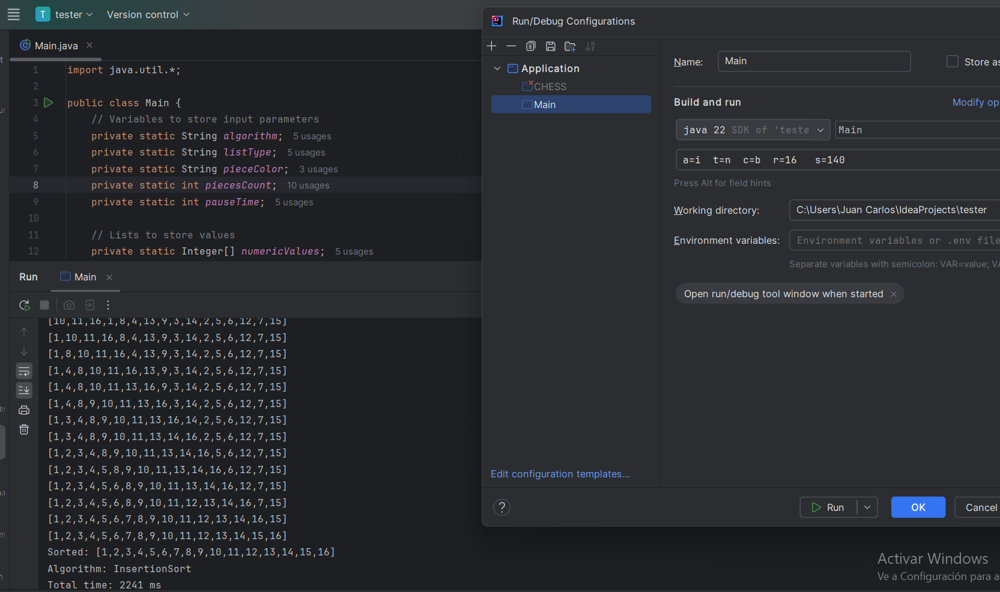
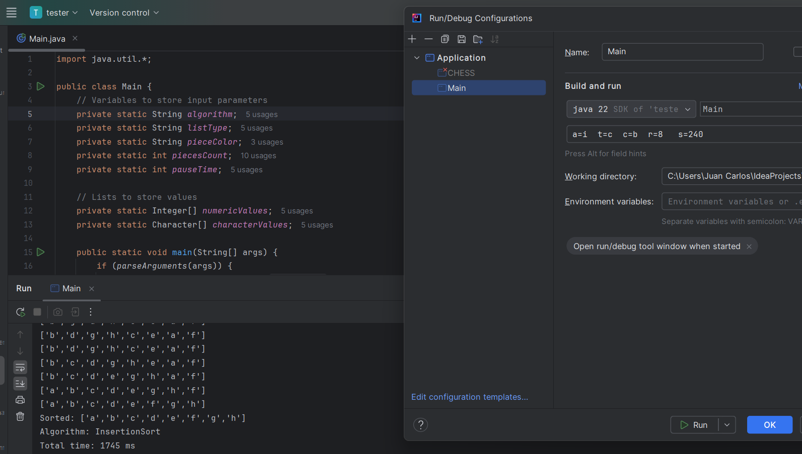
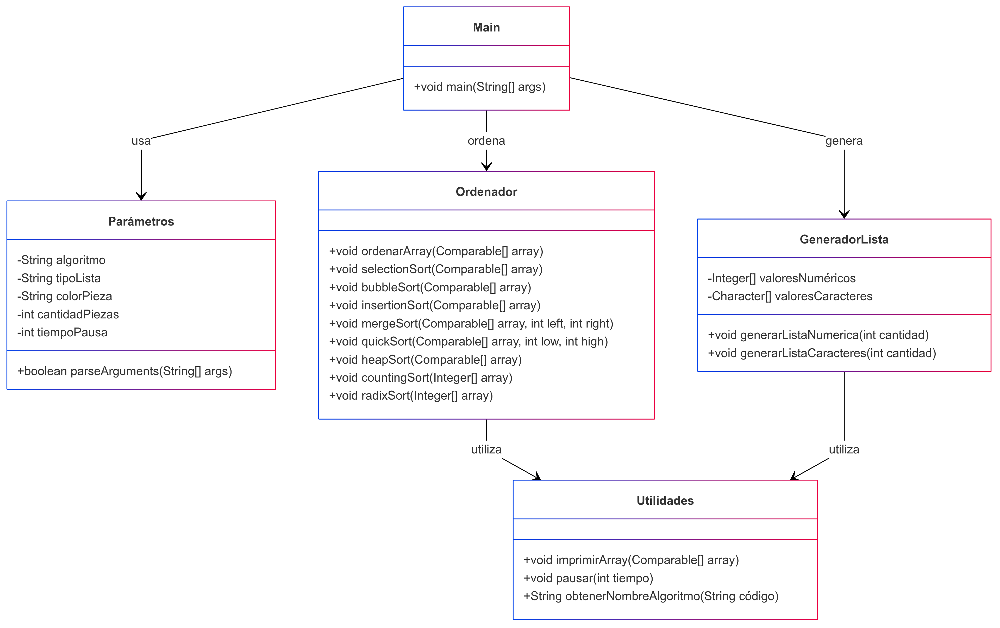

# 📄 **README - Sistema de Ordenamiento de Listas en Java**

## 📝 **Descripción del Proyecto**
Este programa permite ordenar listas de números o caracteres mediante diversos algoritmos de ordenamiento. Los usuarios pueden seleccionar el algoritmo, tipo de lista, color (como referencia), cantidad de elementos y tiempo de pausa entre iteraciones.

El programa imprime el estado de la lista tras cada paso del ordenamiento, lo que facilita la visualización del proceso.

---

## 🚀 **Instrucciones de Ejecución**
Para ejecutar el programa, usa el siguiente comando en la terminal:
```bash
java Main a=<algoritmo> t=<tipo_lista> c=<color> r=<cantidad_piezas> s=<pausa_ms>
```

### **Parámetros:**
| Parámetro | Descripción | Valores válidos |
|-----------|-------------|-----------------|
| `a`       | Algoritmo de ordenamiento | `s` (Selection), `b` (Bubble), `i` (Insertion), `m` (Merge), `q` (Quick), `h` (Heap), `c` (Counting - solo números), `r` (Radix - solo números) |
| `t`       | Tipo de lista | `n` (Numérica), `c` (Carácter) |
| `c`       | Color de piezas (solo informativo) | `b` (Negras), `w` (Blancas) |
| `r`       | Cantidad de piezas | Número entre `1` y `16` |
| `s`       | Pausa entre iteraciones (ms) | Número entre `100` y `1000` |

### **Ejemplos de ejecuciòn:**

```bash
java Main a=i t=n c=b r=16 s=140  # InsertionSort con números
 

java Main a=i t=c c=b r=8 s=240   # InsertionSort con caracteres
 

```

---

## 🧩 **Estructura del Código**
- **`Main`**: Controla el flujo general del programa.
- **Parámetros**: Procesa y valida los argumentos ingresados.
- **GeneradorLista**: Genera listas aleatorias según la entrada.
- **Ordenador**: Contiene los algoritmos de ordenamiento.
- **Utilidades**: Métodos auxiliares para impresión y pausas.

---

## 📊 **Diagramas**
### 🗂️ **Diagrama de Clases:**

 

```

---

## 🛠️ **Algoritmos Implementados**
- Selection Sort 🟢
- Bubble Sort 🟢
- Insertion Sort 🟢
- Merge Sort 🟢
- Quick Sort 🟢
- Heap Sort 🟢
- Counting Sort (solo numérico) 🟢
- Radix Sort (solo numérico) 🟢

---

## ⚠️ **Consideraciones Importantes:**
- La pausa (`s`) debe ser entre `100` y `1000` ms. Valores fuera de este rango cancelan la ejecución.
- La cantidad de piezas (`r`) debe estar entre `1` y `16`.
- Algunos algoritmos (Counting y Radix) solo funcionan con listas numéricas.
- El parámetro `c` (color) es solo informativo y no afecta el ordenamiento.

---
