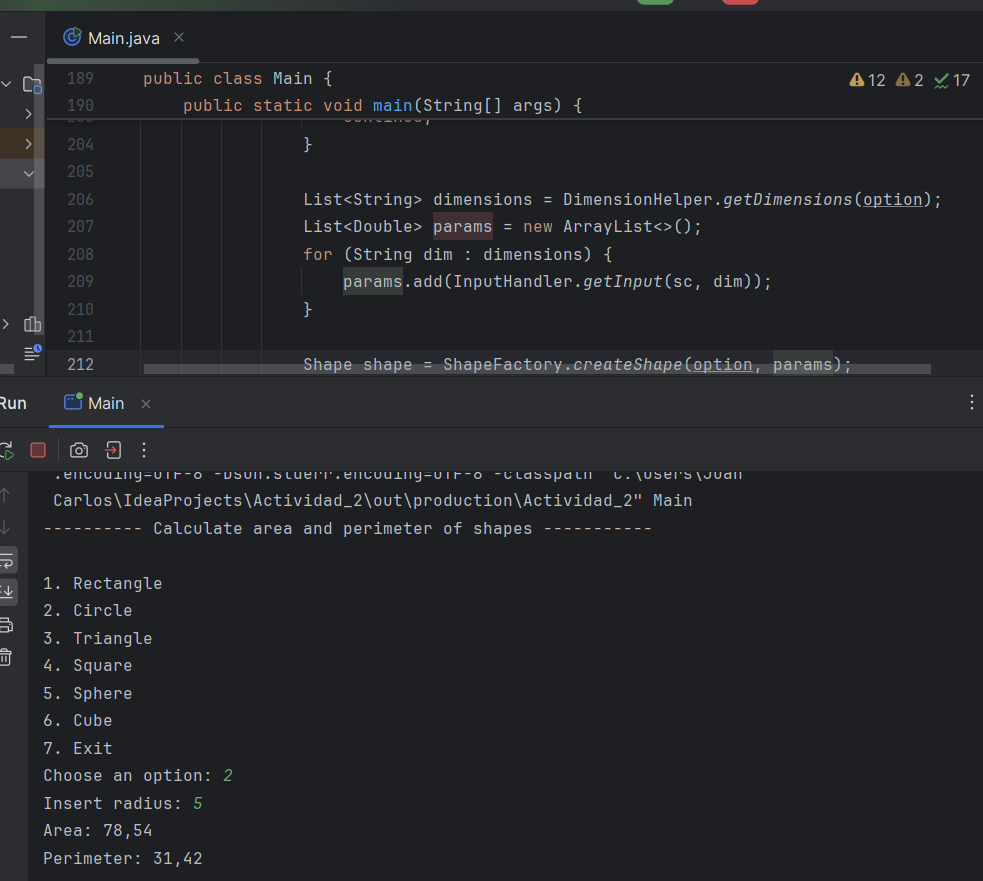
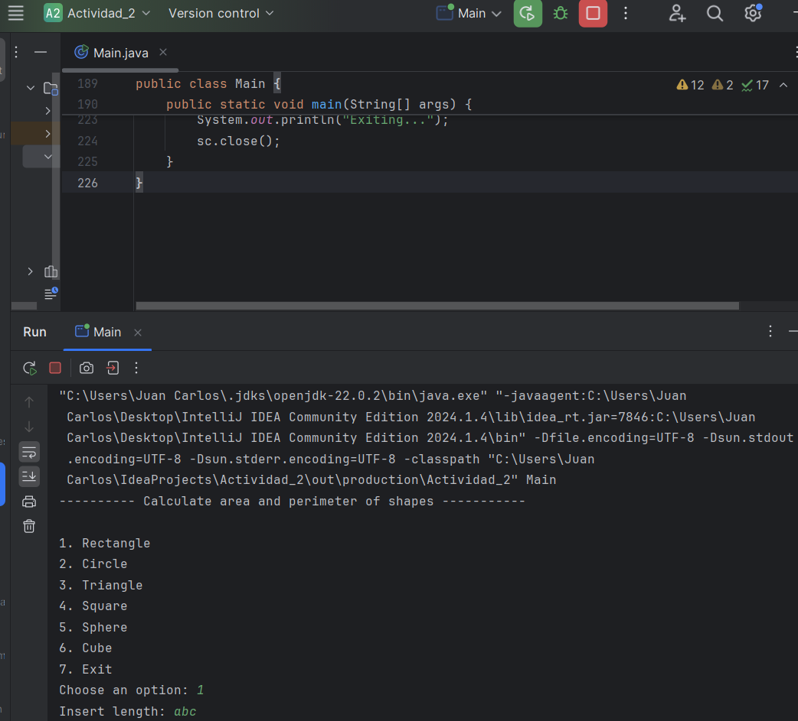
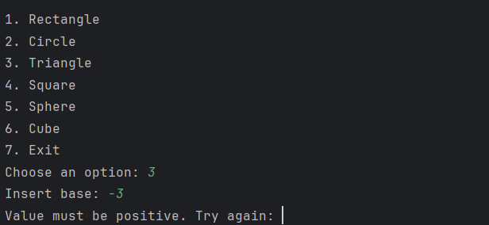
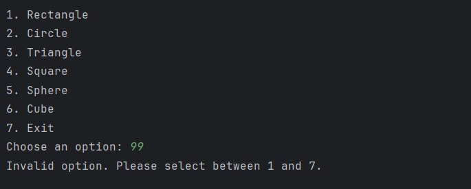
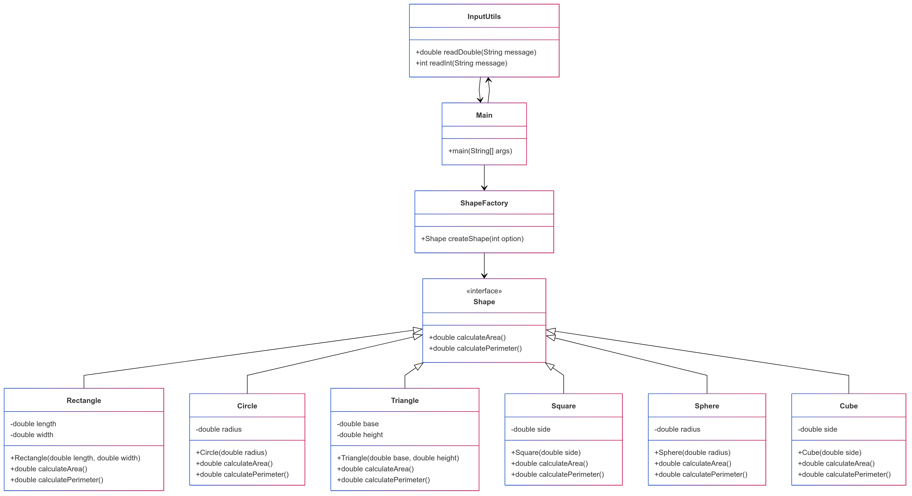

# Calculadora de Figuras Geométricas 📐

Aplicación de consola en Java para calcular el **área** y **perímetro** (o equivalentes) de diversas figuras geométricas, diseñada con una arquitectura limpia, separación de responsabilidades y manejo robusto de excepciones.

---

## 🚀 Características
- **Figuras Soportadas:**
  - 2D: Rectángulo, Círculo, Triángulo, Cuadrado
  - 3D: Esfera, Cubo
- **Validaciones:**
  - Las entradas deben ser números positivos.
  - Manejo de errores para opciones inválidas del menú.
- **Mejoras de Diseño:**
  - Patrón de diseño *Factory* para la creación de figuras.
  - Controladores dedicados para la entrada y salida de datos.
  - Alta cohesión con responsabilidades bien separadas.

---

## 🛠️ ¿Cómo usarlo?
1. **Ejecuta el programa:**
   ```bash
   javac Main.java && java Main
   ```
2. **Selecciona una figura del menú** (1-6) o sal (7).
3. **Introduce las dimensiones requeridas** (por ejemplo, radio, longitud de lado).
4. **Visualiza los resultados:**
   ```plaintext
   Área: 25.00
   Perímetro: 20.00
   ```

### 💻 Ejemplo de interacción:
---------- Calcular área y perímetro de figuras -----------

1. Rectángulo
2. Círculo
3. Triángulo
4. Cuadrado
5. Esfera
6. Cubo
7. Salir
Elige una opción: 2
Introduce el radio: 5
Área: 78.54
Perímetro: 31.42

---
 

## 🧱 Estructura de Clases
| Clase/Componente | Responsabilidad |
|------------------|-----------------|
| **Shape (Interfaz)** | Define `calculateArea()` y `calculatePerimeter()`. |
| **Figuras Concretas** | Implementan `Shape` (por ejemplo, `Circle`, `Cube`). |
| **InputHandler** | Valida y obtiene la entrada del usuario. |
| **DimensionHelper** | Asocia figuras con las dimensiones requeridas. |
| **ShapeFactory** | Crea instancias de figuras según la opción elegida. |
| **MenuHandler** | Muestra y gestiona el menú interactivo. |
| **Main** | Coordina el flujo del programa. |

---

## 🎯 Patrones de Diseño Utilizados
### 1. Patrón *Factory*
`ShapeFactory` crea objetos de figuras sin exponer la lógica de instanciación.

**¿Cómo agregar una nueva figura?**
- Actualiza `DimensionHelper` con los parámetros requeridos.
- Extiende `ShapeFactory` con la lógica de creación.

### 2. Separación de Responsabilidades
- **Entrada/Salida:** Gestionadas por `InputHandler` y `MenuHandler`.
- **Lógica de negocio:** Aislada en las clases de figuras y fábricas.
- **Validación:** Centralizada en `InputHandler`.

---

## 🛡️ Manejo de Errores
### Entradas Inválidas:
 

Introduce la anchura: abc
Entrada inválida. Por favor, introduce un número válido:

### Valores No Positivos:
 

Introduce el radio: -5
El valor debe ser positivo. Inténtalo de nuevo:

### Opciones de Menú Inválidas:
 
Elige una opción: 8
Opción inválida. Por favor, selecciona entre 1 y 7.


---

## 📝 Diagrama de Clases
 

```


